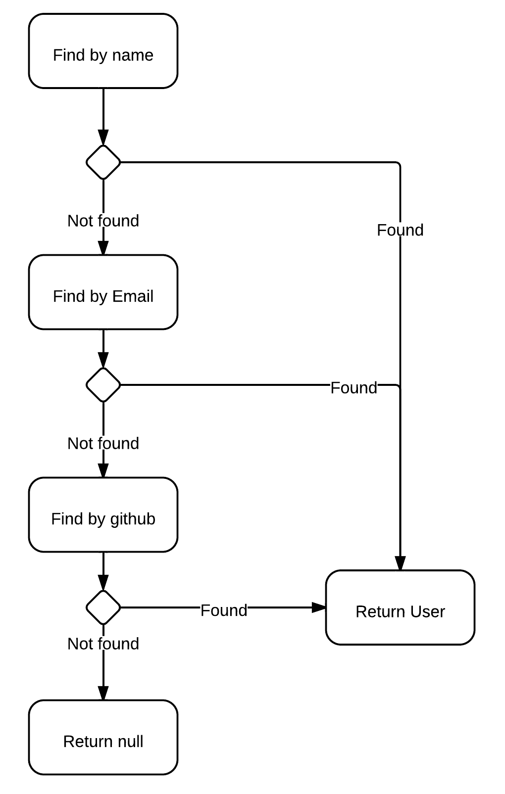

# Flow Control Examples

## Conditional Continuation

This seems like a simple enough problem when written in the standard synchronous way. 
As soon as you switch to asynchronous the intent is lost amongst a heap of async code.

[Synchronous Version](sync.js)